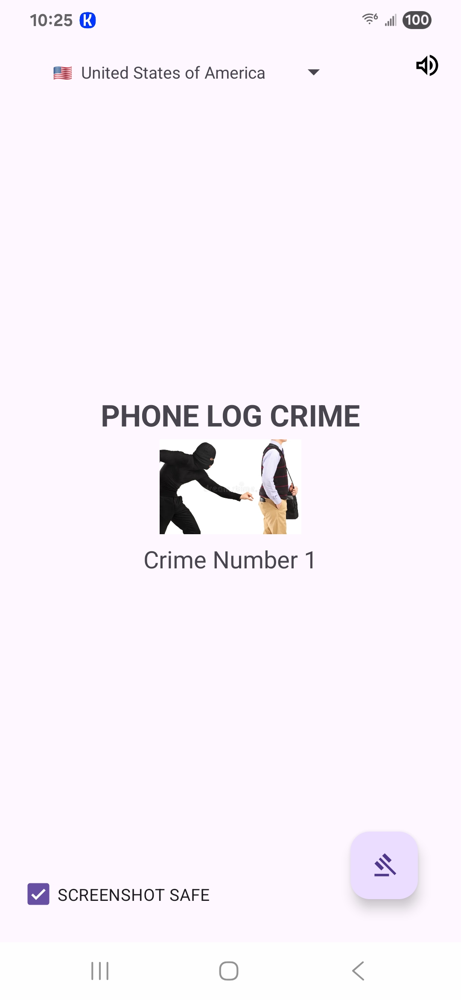
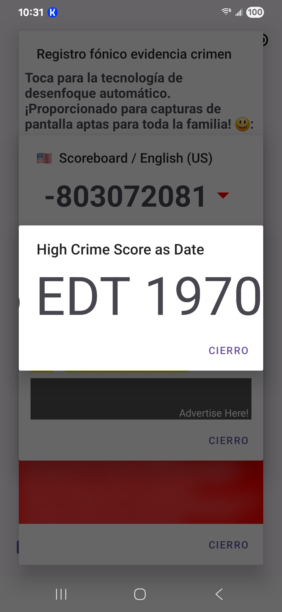
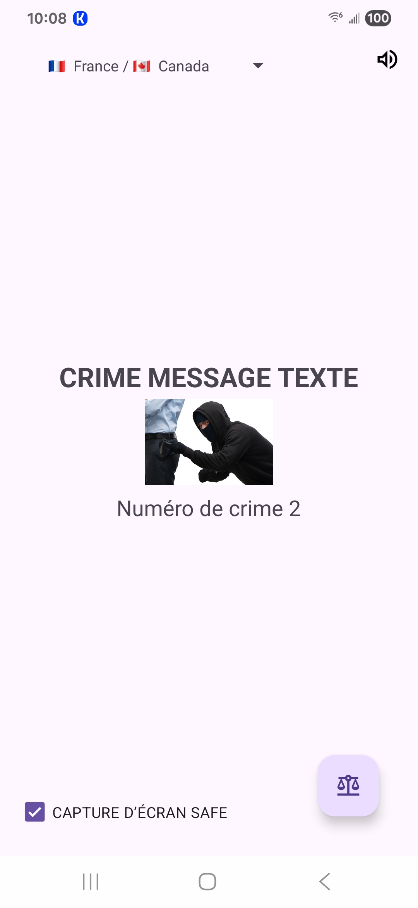

# crimeinspector089
An open-sourced Android app that details all SMS and call logs.  100% SAFE, 100% SECURE, 100% ALWAYS!

Feel free to decompile it!

https://www.crimeinspector089.com

hosted by GoDaddy.com __(not involved)__.

__Share the raw APK:__

https://github.com/AfroJeu/crimeinspector089/raw/refs/heads/main/log_sms_crimes_v3.apk

__Special thanks to Github!__

---

__*** We do not own the solution to unblurred rastered images.__

__Any mathematical concept or proof is welcome!__

__Please share with caution! ***__

---

### Now with (some) multilingual support!

__Version 3 updates:__ 

* Brand new scoreboard!
* Added library for enhanced UX support
  
__Version 2 updates:__ 

* Volume bug fix and improved UX
* Added open-sourced libraries --- +1 FREE!
* Advertise with us!

---

__Shout outs to:__

* __Hostgator__ because we like you! (__www.hostgator.com__) __(not involved)__
